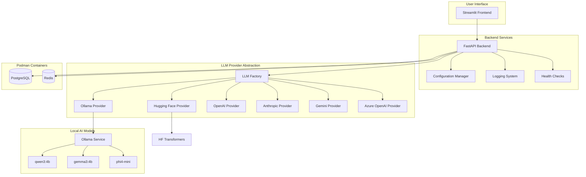

# Phase 0-0.5 Architecture Plan

## Overview

This document outlines the architecture for Phase 0 (Core Foundation), Phase 0.25 (Local AI Infrastructure), and Phase 0.5 (Provider Abstraction Layer) of the Enterprise Agentic RAG Platform.

## System Architecture



## Directory Structure

```
enterprise-agentic-rag/
├── backend/
│   ├── api/
│   │   ├── __init__.py
│   │   ├── main.py              # FastAPI app entry point
│   │   ├── routes/
│   │   │   ├── __init__.py
│   │   │   ├── health.py        # Health check endpoints
│   │   │   └── status.py        # Status endpoints
│   │   └── middleware/
│   │       ├── __init__.py
│   │       ├── cors.py
│   │       └── logging.py
│   ├── core/
│   │   ├── __init__.py
│   │   ├── config.py            # Configuration management
│   │   ├── settings.py          # Pydantic settings
│   │   └── logging.py           # Logging configuration
│   ├── providers/
│   │   ├── __init__.py
│   │   ├── base.py              # Abstract provider interface
│   │   ├── factory.py           # LLM Factory
│   │   ├── ollama.py            # Ollama provider
│   │   ├── huggingface.py       # Hugging Face provider
│   │   ├── openai.py            # OpenAI provider
│   │   ├── anthropic.py         # Anthropic provider
│   │   ├── gemini.py            # Gemini provider
│   │   └── azure.py             # Azure OpenAI provider
│   ├── llm/
│   │   ├── __init__.py
│   │   └── models.py            # Model configurations
│   └── tests/
│       ├── __init__.py
│       ├── test_providers.py
│       └── test_api.py
├── frontend/
│   └── streamlit/
│       ├── app.py               # Main Streamlit app
│       ├── components/
│       │   ├── __init__.py
│       │   ├── sidebar.py
│       │   └── chat.py
│       └── utils/
│           ├── __init__.py
│           └── api_client.py
├── data/
│   ├── raw/
│   ├── processed/
│   └── vectorstore/
├── deploy/
│   └── podman/
│       ├── Containerfile        # Backend container
│       ├── podman-compose.yml   # Multi-container setup
│       └── scripts/
│           ├── start.sh
│           └── stop.sh
├── docs/
│   ├── architecture.md
│   ├── api.md
│   └── setup.md
├── scripts/
│   ├── setup_env.sh
│   ├── start_dev.sh
│   └── test_all.sh
├── .env.example
├── .env.local
├── .gitignore
├── requirements.txt
├── README.md
└── CONTRIBUTING.md
```

## Component Details

### 1. FastAPI Backend

**Purpose**: RESTful API server for handling requests

**Key Features**:

- CORS middleware for frontend communication
- Request/response logging
- Error handling
- Health check endpoints
- Status monitoring

**Endpoints**:

- `GET /health` - Basic health check
- `GET /status` - Detailed service status
- `GET /api/v1/providers` - List available LLM providers
- `POST /api/v1/chat` - Chat endpoint (Phase 1+)

### 2. Configuration Management

**Purpose**: Centralized configuration using Pydantic

**Features**:

- Environment-based configuration
- Type validation
- Secret management
- Provider-specific settings

**Configuration Hierarchy**:

```
.env.local (local overrides)
  ↓
.env.example (defaults)
  ↓
settings.py (Pydantic models)
  ↓
config.py (runtime config)
```

### 3. Logging System

**Purpose**: Structured logging with rotation

**Features**:

- JSON structured logs
- Log rotation (size-based)
- Multiple log levels
- Request tracing
- Performance metrics

**Log Levels**:

- DEBUG: Development debugging
- INFO: General information
- WARNING: Warning messages
- ERROR: Error conditions
- CRITICAL: Critical failures

### 4. LLM Provider Abstraction

**Purpose**: Unified interface for multiple LLM providers

**Design Pattern**: Abstract Factory + Strategy

**Provider Interface**:

```python
class BaseLLMProvider(ABC):
    @abstractmethod
    async def generate(self, prompt: str, **kwargs) -> str:
        pass

    @abstractmethod
    async def stream(self, prompt: str, **kwargs) -> AsyncIterator[str]:
        pass

    @abstractmethod
    async def health_check(self) -> bool:
        pass
```

**Factory Pattern**:

```python
class LLMFactory:
    @staticmethod
    def create(provider: str, **config) -> BaseLLMProvider:
        # Dynamic provider selection
        # Fallback mechanism
        # Configuration validation
```

### 5. Ollama Provider

**Purpose**: Interface with local Ollama service

**Features**:

- Connection validation
- Model availability check
- Streaming support
- Error handling

**Supported Models**:

- qwen3:4b (primary)
- gemma3:4b (secondary)
- phi4-mini (lightweight)

### 6. Hugging Face Provider

**Purpose**: Interface with Hugging Face Transformers

**Features**:

- Model loading and caching
- GPU/CPU detection
- Memory management
- Quantization support

**Supported Models**:

- Qwen/Qwen3-4B-Instruct
- google/gemma-3-4b-it
- microsoft/Phi-4-mini-instruct

### 7. Cloud Provider Stubs

**Purpose**: Placeholder implementations for future cloud providers

**Providers**:

- OpenAI (GPT-4, GPT-3.5)
- Anthropic (Claude)
- Gemini (Gemini Pro)
- Azure OpenAI

**Implementation**: Basic structure with TODO markers for Phase 10

### 8. Streamlit Frontend

**Purpose**: User interface for interacting with the system

**Features**:

- Chat interface
- Provider selection
- Configuration panel
- Status monitoring

**Components**:

- Sidebar: Configuration and settings
- Main area: Chat interface
- Footer: Status indicators

### 9. Podman Infrastructure

**Purpose**: Containerized services for development

**Services**:

- PostgreSQL: Relational database
- Redis: Cache and session storage

**Configuration**:

```yaml
services:
  postgres:
    image: postgres:16
    environment:
      POSTGRES_DB: rag_platform
      POSTGRES_USER: rag_user
      POSTGRES_PASSWORD: ${DB_PASSWORD}
    ports:
      - '5432:5432'
    volumes:
      - postgres_data:/var/lib/postgresql/data

  redis:
    image: redis:7-alpine
    ports:
      - '6379:6379'
    volumes:
      - redis_data:/data
```

## Technology Stack

### Backend

- **Python**: 3.12+
- **FastAPI**: 0.109+
- **Pydantic**: 2.5+
- **uvicorn**: 0.27+
- **python-dotenv**: 1.0+

### LLM Integration

- **langchain**: 0.1+
- **langchain-community**: 0.0.20+
- **ollama**: 0.1+
- **transformers**: 4.36+
- **torch**: 2.1+

### Database

- **psycopg2-binary**: 2.9+
- **redis**: 5.0+
- **sqlalchemy**: 2.0+

### Frontend

- **streamlit**: 1.30+
- **requests**: 2.31+

### Development

- **pytest**: 7.4+
- **black**: 23.12+
- **ruff**: 0.1+

## Configuration Files

### .env.example

```env
# Application
APP_NAME=Enterprise Agentic RAG Platform
APP_VERSION=0.1.0
ENVIRONMENT=development
DEBUG=true

# API
API_HOST=0.0.0.0
API_PORT=8000

# Database
DB_HOST=localhost
DB_PORT=5432
DB_NAME=rag_platform
DB_USER=rag_user
DB_PASSWORD=changeme

# Redis
REDIS_HOST=localhost
REDIS_PORT=6379

# Ollama
OLLAMA_HOST=http://localhost:11434
OLLAMA_DEFAULT_MODEL=qwen3:4b

# Hugging Face
HF_HOME=./models
HF_DEFAULT_MODEL=Qwen/Qwen3-4B-Instruct

# LLM Provider
DEFAULT_PROVIDER=ollama
FALLBACK_PROVIDER=huggingface

# Logging
LOG_LEVEL=INFO
LOG_FILE=logs/app.log
LOG_MAX_SIZE=10485760
LOG_BACKUP_COUNT=5
```

## Development Workflow

### Setup

```bash
# Create virtual environment
python -m venv venv
source venv/bin/activate  # Windows: venv\Scripts\activate

# Install dependencies
pip install -r requirements.txt

# Start Podman services
cd deploy/podman
podman-compose up -d

# Run backend
cd backend
uvicorn api.main:app --reload

# Run frontend (separate terminal)
cd frontend/streamlit
streamlit run app.py
```

### Testing

```bash
# Run all tests
pytest backend/tests/

# Run specific test
pytest backend/tests/test_providers.py

# Run with coverage
pytest --cov=backend backend/tests/
```

## Success Criteria

### Phase 0 - Core Foundation

- ✅ FastAPI server running
- ✅ Streamlit app accessible
- ✅ Configuration management working
- ✅ Logging system operational
- ✅ Health checks responding

### Phase 0.25 - Local AI Infrastructure

- ✅ PostgreSQL container running
- ✅ Redis container running
- ✅ Ollama connectivity verified
- ✅ Models loaded successfully

### Phase 0.5 - Provider Abstraction

- ✅ Provider interface defined
- ✅ Ollama provider functional
- ✅ Hugging Face provider functional
- ✅ Factory pattern implemented
- ✅ Fallback mechanism working
- ✅ All providers health-checked

## Next Steps

After completing Phase 0-0.5, the platform will be ready for:

- **Phase 1**: Basic RAG implementation
- **Phase 2**: Hybrid retrieval
- **Phase 3**: Query understanding
- And beyond...

## References

- [FastAPI Documentation](https://fastapi.tiangolo.com/)
- [Streamlit Documentation](https://docs.streamlit.io/)
- [Ollama Documentation](https://ollama.ai/docs)
- [Hugging Face Transformers](https://huggingface.co/docs/transformers)
- [Podman Documentation](https://docs.podman.io/)
