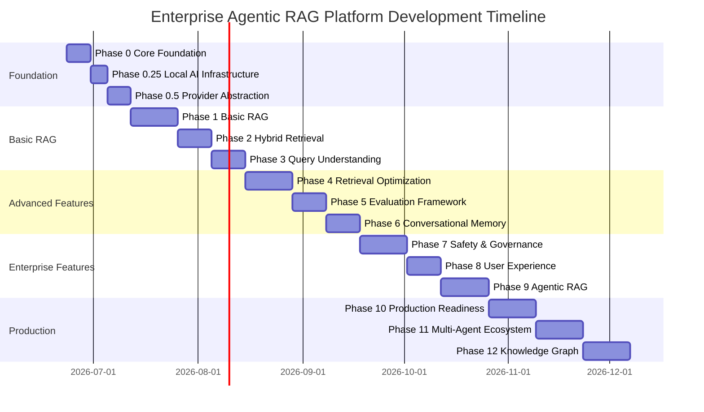

# Enterprise Agentic RAG Platform - Project Roadmap

## Executive Summary

This roadmap outlines the development plan for building a production-ready Enterprise Agentic RAG Platform from Phase 0 (Core Foundation) through Phase 12 (Knowledge Graph Enhancement).

**Timeline**: 12 phases, estimated 6-9 months for full implementation
**Current Focus**: Phase 0 - 0.5 (Foundation & Provider Abstraction)

## Phase Overview

## Detailed Phase Breakdown

### ✅ Phase 0: Core Foundation (Week 1)

**Status**: In Planning

**Objectives**:

- Establish project structure
- Set up FastAPI backend
- Set up Streamlit frontend
- Configure development environment
- Implement logging and configuration

**Deliverables**:

- [ ] Working FastAPI server
- [ ] Streamlit application
- [ ] Configuration management
- [ ] Logging system
- [ ] Health check endpoints

**Key Files**:

- `backend/api/main.py` - FastAPI application
- `backend/core/settings.py` - Configuration
- `backend/core/logging.py` - Logging setup
- `frontend/streamlit/app.py` - Streamlit UI
- `requirements.txt` - Dependencies

**Success Criteria**:

- FastAPI server responds to health checks
- Streamlit app loads successfully
- Logs are written to file
- Configuration loads from environment

---

### ✅ Phase 0.25: Local AI Infrastructure (Week 1-2)

**Status**: In Planning

**Objectives**:

- Configure Podman containers
- Set up PostgreSQL database
- Set up Redis cache
- Verify Ollama installation
- Configure model access

**Deliverables**:

- [ ] PostgreSQL container running
- [ ] Redis container running
- [ ] Podman Compose configuration
- [ ] Database connectivity verified
- [ ] Ollama models accessible

**Key Files**:

- `deploy/podman/podman-compose.yml`
- `deploy/podman/scripts/start.sh`
- `deploy/podman/scripts/stop.sh`

**Success Criteria**:

- All containers start successfully
- Database connections work
- Ollama responds to API calls
- Models are loaded and ready

---

### ✅ Phase 0.5: Provider Abstraction Layer (Week 2)

**Status**: In Planning

**Objectives**:

- Design provider interface
- Implement Ollama provider
- Implement Hugging Face provider
- Create LLM Factory
- Implement fallback mechanism

**Deliverables**:

- [ ] Abstract provider interface
- [ ] Ollama provider implementation
- [ ] Hugging Face provider implementation
- [ ] Cloud provider stubs
- [ ] Factory with fallback logic
- [ ] Provider health checks

**Key Files**:

- `backend/providers/base.py`
- `backend/providers/ollama.py`
- `backend/providers/huggingface.py`
- `backend/providers/factory.py`

**Success Criteria**:

- Providers implement common interface
- Factory creates providers dynamically
- Fallback works when primary fails
- Health checks report status correctly

---

### 🔄 Phase 1: Basic RAG (Week 3-4)

**Objectives**:

- Implement document ingestion
- Add PDF/DOCX parsing
- Implement text chunking
- Set up FAISS vector store
- Create embeddings pipeline
- Build basic retrieval
- Implement answer generation

**Deliverables**:

- Document upload API
- Text processing pipeline
- Vector indexing
- Retrieval endpoint
- Chat endpoint
- Source attribution

**Key Components**:

- `backend/ingestion/` - Document processing
- `backend/retrievers/` - Retrieval logic
- `backend/api/routes/chat.py` - Chat endpoint

**Success Criteria**:

- Can upload and process documents
- Documents are chunked and embedded
- Retrieval returns relevant chunks
- LLM generates answers with sources

---

### 🔄 Phase 2: Hybrid Retrieval (Week 5-6)

**Objectives**:

- Implement BM25 retrieval
- Add hybrid search
- Implement Reciprocal Rank Fusion
- Compare retrieval strategies

**Deliverables**:

- BM25 retriever
- Hybrid search combiner
- RRF implementation
- Performance metrics

**Key Components**:

- `backend/retrievers/bm25.py`
- `backend/retrievers/hybrid.py`
- `backend/retrievers/fusion.py`

**Success Criteria**:

- BM25 retrieval works
- Hybrid search combines results
- RRF improves ranking
- Better recall than single method

---

### 🔄 Phase 3: Query Understanding (Week 7-8)

**Objectives**:

- Implement query expansion
- Add query reformulation
- Implement HyDE
- Improve query processing

**Deliverables**:

- Query expansion module
- Reformulation strategies
- HyDE implementation
- Query router

**Key Components**:

- `backend/agents/query_rewriter.py`
- `backend/agents/hyde.py`

**Success Criteria**:

- Queries are expanded effectively
- Reformulation improves results
- HyDE generates useful hypotheses
- Better recall on complex queries

---

### 🔄 Phase 4: Retrieval Optimization (Week 9-10)

**Objectives**:

- Implement multi-vector retrieval
- Add cross-encoder reranking
- Implement context compression
- Optimize retrieval pipeline

**Deliverables**:

- Multi-vector retriever
- Cross-encoder reranker
- Context compressor
- Optimized pipeline

**Key Components**:

- `backend/rerankers/cross_encoder.py`
- `backend/retrievers/multi_vector.py`

**Success Criteria**:

- Reranking improves precision
- Context compression reduces tokens
- Multi-vector improves coverage
- Higher answer relevance

---

### 🔄 Phase 5: Evaluation Framework (Week 11-12)

**Objectives**:

- Integrate RAGAS
- Implement evaluation metrics
- Create test datasets
- Build evaluation pipeline

**Deliverables**:

- RAGAS integration
- Evaluation endpoints
- Test datasets
- Automated reports

**Key Components**:

- `backend/evaluators/ragas.py`
- `backend/evaluators/metrics.py`

**Success Criteria**:

- RAGAS metrics calculated
- Evaluation runs automatically
- Reports generated
- Metrics tracked over time

---

### 🔄 Phase 6: Conversational Memory (Week 13-14)

**Objectives**:

- Implement Redis memory
- Add session management
- Create conversation summaries
- Build long-term memory

**Deliverables**:

- Redis memory backend
- Session manager
- Summary generator
- Memory retrieval

**Key Components**:

- `backend/memory/redis.py`
- `backend/memory/session.py`
- `backend/memory/summary.py`

**Success Criteria**:

- Conversations persist
- Context maintained across turns
- Summaries generated
- Long-term memory works

---

### 🔄 Phase 7: Safety & Governance (Week 15-16)

**Objectives**:

- Implement prompt injection detection
- Add hallucination detection
- Implement PII detection
- Add toxicity detection
- Create guardrails

**Deliverables**:

- Security guardrails
- Content filters
- PII redaction
- Toxicity checker

**Key Components**:

- `backend/guardrails/security.py`
- `backend/guardrails/content.py`
- `backend/guardrails/pii.py`

**Success Criteria**:

- Prompt injections blocked
- Hallucinations detected
- PII redacted
- Toxic content filtered

---

### 🔄 Phase 8: User Experience (Week 17-18)

**Objectives**:

- Implement streaming responses
- Add source citations
- Create chat history UI
- Build document management

**Deliverables**:

- SSE streaming
- Citation display
- History viewer
- Document manager

**Key Components**:

- `frontend/streamlit/components/chat.py`
- `frontend/streamlit/components/documents.py`

**Success Criteria**:

- Responses stream smoothly
- Sources displayed clearly
- History accessible
- Documents manageable

---

### 🔄 Phase 9: Agentic RAG (Week 19-20)

**Objectives**:

- Implement LangGraph router
- Add strategy selection
- Create decision agents
- Build adaptive workflows

**Deliverables**:

- LangGraph integration
- Agent router
- Strategy selector
- Workflow engine

**Key Components**:

- `backend/agents/router.py`
- `backend/agents/strategies.py`

**Success Criteria**:

- Router selects strategies
- Agents make decisions
- Workflows adapt
- Better results than static

---

### 🔄 Phase 10: Production Readiness (Week 21-22)

**Objectives**:

- Implement authentication
- Add monitoring
- Set up observability
- Create deployment configs
- Implement feedback collection

**Deliverables**:

- JWT authentication
- OAuth2 integration
- LangSmith monitoring
- OpenTelemetry traces
- Feedback system

**Key Components**:

- `backend/api/auth.py`
- `backend/monitoring/langsmith.py`
- `backend/monitoring/telemetry.py`

**Success Criteria**:

- Authentication works
- Monitoring active
- Traces collected
- Feedback captured
- Production ready

---

### 🔄 Phase 11: Multi-Agent Ecosystem (Week 23-24)

**Objectives**:

- Create specialized agents
- Implement agent coordination
- Build agent communication
- Create agent marketplace

**Deliverables**:

- Research agent
- Retrieval agent
- Evaluation agent
- Governance agent
- Knowledge agent

**Key Components**:

- `backend/agents/research.py`
- `backend/agents/retrieval.py`
- `backend/agents/evaluation.py`

**Success Criteria**:

- Agents specialized
- Coordination works
- Communication clear
- Marketplace functional

---

### 🔄 Phase 12: Knowledge Graph Enhancement (Week 25-26)

**Objectives**:

- Implement entity extraction
- Build relationship mapping
- Create graph retrieval
- Implement hybrid graph+vector search

**Deliverables**:

- Entity extractor
- Relationship mapper
- Graph database
- Hybrid retrieval

**Key Components**:

- `backend/knowledge_graph/entities.py`
- `backend/knowledge_graph/relationships.py`
- `backend/retrievers/graph.py`

**Success Criteria**:

- Entities extracted
- Relationships mapped
- Graph searchable
- Hybrid search works

---

## Technology Evolution

### Phase 0-0.5 (Current)

- FastAPI
- Streamlit
- Ollama
- Hugging Face
- PostgreSQL
- Redis
- Podman

### Phase 1-3

- - LangChain
- - FAISS
- - BM25
- - BGE Embeddings

### Phase 4-6

- - Cross-Encoder
- - RAGAS
- - Redis Memory

### Phase 7-9

- - Guardrails
- - LangGraph
- - Agent Framework

### Phase 10-12

- - LangSmith
- - OpenTelemetry
- - Knowledge Graph
- - Neo4j (optional)

## Risk Management

### Technical Risks

**Risk**: Model performance on CPU

- **Mitigation**: Use smaller models (4B parameters)
- **Fallback**: Cloud providers for production

**Risk**: Memory constraints

- **Mitigation**: Implement streaming and batching
- **Fallback**: Reduce batch sizes

**Risk**: Retrieval accuracy

- **Mitigation**: Hybrid search + reranking
- **Fallback**: Multiple retrieval strategies

### Project Risks

**Risk**: Scope creep

- **Mitigation**: Strict phase boundaries
- **Fallback**: Defer features to later phases

**Risk**: Integration complexity

- **Mitigation**: Provider abstraction layer
- **Fallback**: Focus on core providers first

## Success Metrics

### Phase 0-0.5

- ✅ All services running
- ✅ Providers functional
- ✅ Health checks passing

### Phase 1-3

- 📊 Retrieval accuracy > 70%
- 📊 Response time < 5s
- 📊 Answer relevance > 75%

### Phase 4-6

- 📊 Retrieval accuracy > 85%
- 📊 Context precision > 80%
- 📊 Faithfulness > 90%

### Phase 7-9

- 📊 Zero security incidents
- 📊 PII detection > 95%
- 📊 Adaptive routing improves results by 15%

### Phase 10-12

- 📊 Production uptime > 99%
- 📊 Authentication secure
- 📊 Knowledge graph enhances accuracy by 20%

## Resource Requirements

### Development Environment

- Python 3.12+
- 32GB RAM
- 100GB storage
- Podman
- Ollama

### Production Environment (Future)

- Kubernetes cluster
- Cloud LLM APIs
- Vector database (Pinecone/Weaviate)
- Monitoring stack

## Next Actions

### Immediate (This Week)

1. ✅ Review and approve plan
2. 🔄 Set up project structure
3. 🔄 Create virtual environment
4. 🔄 Install dependencies
5. 🔄 Start Podman services

### Short Term (Next 2 Weeks)

1. Complete Phase 0
2. Complete Phase 0.25
3. Complete Phase 0.5
4. Begin Phase 1 planning

### Medium Term (Next Month)

1. Complete Phase 1 (Basic RAG)
2. Complete Phase 2 (Hybrid Retrieval)
3. Begin Phase 3 (Query Understanding)

## Documentation

### Current Documentation

- ✅ Development Document.md
- ✅ phase-0-architecture.md
- ✅ implementation-guide.md
- ✅ project-roadmap.md

### Planned Documentation

- API documentation (OpenAPI)
- User guide
- Deployment guide
- Troubleshooting guide
- Contributing guidelines

## Conclusion

This roadmap provides a clear path from foundation to production-ready enterprise platform. Each phase builds on the previous, with clear deliverables and success criteria.

**Current Status**: Phase 0-0.5 Planning Complete
**Next Step**: Begin implementation with Code mode

---

_Last Updated: 2026-06-23_
_Version: 1.0_
